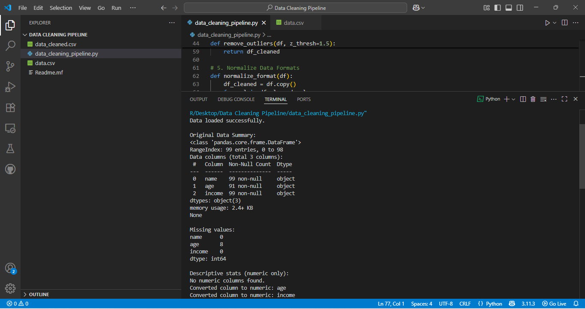

# Data Cleaning Pipeline

An end-to-end Python script to clean CSV datasets by handling missing values, removing outliers, and normalizing inconsistent formats.

---

## Features

* Loads CSV data
* Provides initial and cleaned data summaries
* Converts numeric columns with error handling
* Fills missing values (mean strategy for numeric, "unknown" for others)
* Removes outliers using IQR method
* Normalizes string formats (lowercase, strip spaces)
* Saves cleaned dataset as a new CSV file

---

## Technologies Used

* Python 3
* Pandas
* NumPy

---

## Usage

1. Place your dataset CSV file (e.g., `data.csv`) in the same directory.
2. Run the script:

   ```bash
   python data_cleaning_pipeline.py
   ```
3. The cleaned file will be saved as `data_cleaned.csv`.

---

## Sample Output

Below are the screenshot of the script running and showing summary statistics and cleaning logs:



---

## Notes

* The pipeline automatically converts applicable columns to numeric.
* Outliers are removed based on the interquartile range (IQR).
* Missing numeric values are filled with the mean.
* String columns are normalized to lowercase and stripped of whitespace.
